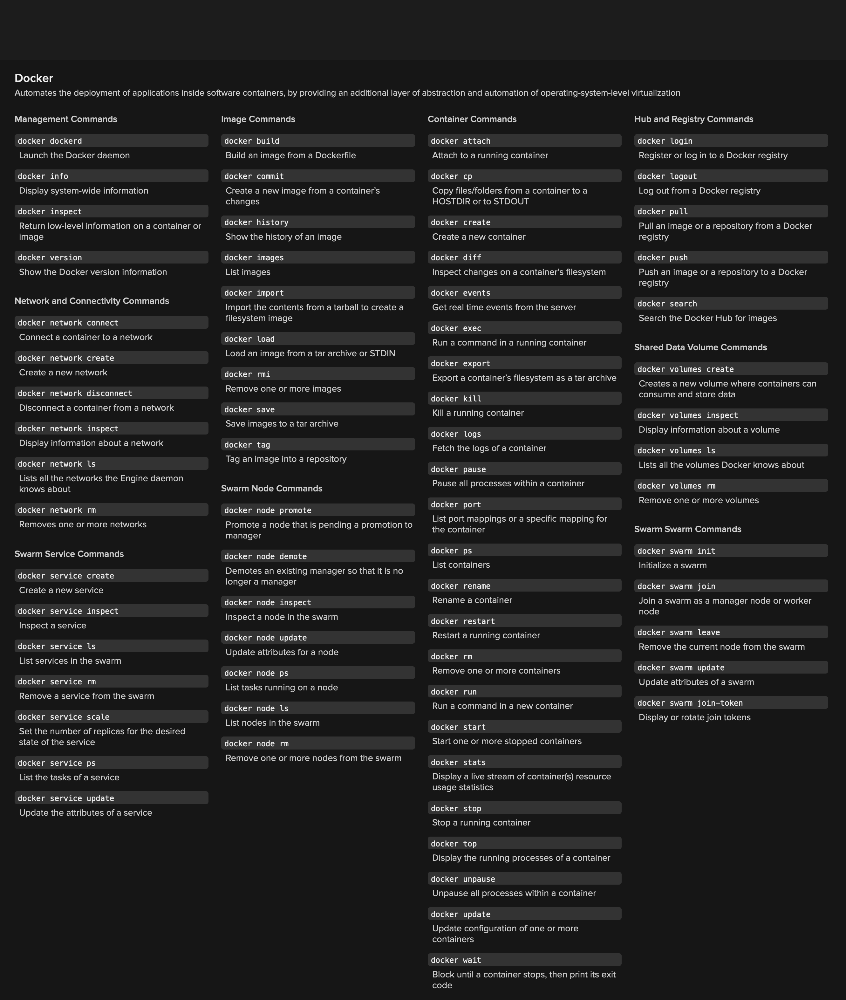
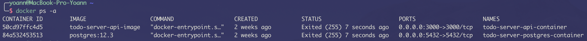
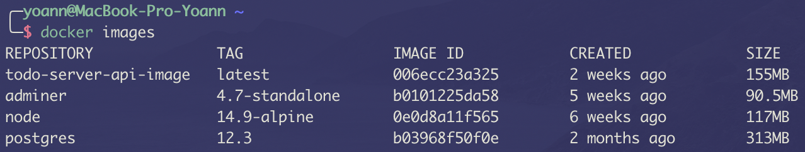

# Docker ressources

[https://docs.docker.com/get-started/nodejs/build-images/](https://docs.docker.com/get-started/nodejs/build-images/)

[https://docker-curriculum.com/](https://docker-curriculum.com/)

[https://www.tutorialspoint.com/docker/index.htm](https://www.tutorialspoint.com/docker/index.htm)



Afficher la liste de ses containers lancés

```bash
docker ps
```

Afficher la liste de tous ses containers (même arrêtés)

```bash
docker ps -a
```



Voir les logs d'un container

```bash
docker logs -f <id ou nom>
```

Delete un container

```bash
docker rm <id ou nom>
```

Entrer dans un container (pour faire des commandes)

```bash
docker exec -it <id ou nom> <command (ex bash)>
```

Voir la liste des images

```bash
docker images
```



Supprimer une image

```bash
docker rmi <id ou nom>
```
